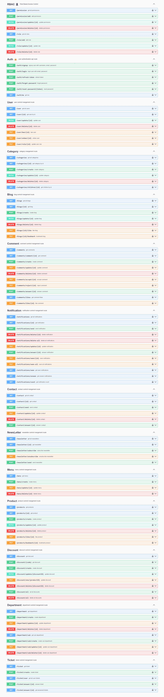

# Store Project

A scalable Node.js-based backend for managing an e-commerce platform. This project includes authentication, product and category management, a blog system, user support through a ticketing system, newsletters, and more. It’s designed with a service-based architecture, following best practices for maintainability and scalability.

## Table of Contents

- [Features](#features)
- [Project Structure](#project-structure)
- [Installation](#installation)
- [Environment Variables](#environment-variables)
- [Usage](#usage)
- [API Documentation](#api-documentation)
- [API Endpoints](#api-endpoints)
  - [Authentication](#authentication)
  - [User Management](#user-management)
  - [Product Management](#product-management)
  - [Category Management](#category-management)
  - [Discount Management](#discount-management)
  - [Blog](#blog)
  - [Comments](#comments)
  - [Newsletter](#newsletter)
  - [Notifications](#notifications)
  - [Tickets](#tickets)
  - [Role and Permissions](#role-and-permissions)
- [Contributing](#contributing)
- [License](#license)

## Features

- **Authentication & Authorization**: Secure login, registration, and role-based access control (RBAC).
- **Product Management**: Manage products with categories and discounts.
- **Blog System**: Blog management with categories and comments.
- **Support System**: Manage user tickets for customer support.
- **Notifications**: Real-time notifications for users.
- **Newsletter**: Send newsletters to users.
- **Contact Form**: Handle user queries through a contact form.
- **Validation**: Request validation with comprehensive error handling.

## Project Structure

The project is organized into multiple layers for better separation of concerns:

```
    src/ 
        |-- configs/ 
        | |-- db.config.js # Database connection configuration 
        | |-- swagger.config.js # Swagger configuration for API documentation 
        |-- constants/ 
        | |-- constants.js # Application-wide constants 
        |-- controllers/ # Route handlers for different modules 
        | |-- auth.controller.js 
        | |-- blog.controller.js 
        | |-- categories.controller.js 
        | |-- ... # Other controllers 
        |-- middlewares/ 
        | |-- guard/ 
        | |-- authenticate.guard.js # JWT authentication guard 
        | |-- permission.guard.js # Role-based access control guard 
        | |-- tags.middleware.js # Middleware for managing tags 
        | |-- uploader.middleware.js # File upload handling 
        |-- models/ # Mongoose models for database schemas 
        | |-- ban.model.js 
        | |-- blog.model.js 
        | |-- ... # Other models 
        |-- routes/ # Define routes for each module 
        | |-- swagger/ # Swagger documentation for APIs 
        | |-- auth.routes.js 
        | |-- blog.routes.js 
        | |-- ... # Other routes 
        |-- services/ # Business logic for each module 
        | |-- auth.service.js 
        | |-- blog.service.js 
        | |-- ... # Other services 
        |-- utils/ # Utility functions 
        | |-- function.utils.js 
        | |-- hash.utils.js # Password hashing utilities 
        | |-- token.utils.js # Token generation and verification 
        |-- validations/ # Input validation schemas 
        | |-- auth.validation.js 
        | |-- blog.validation.js 
        | |-- ... # Other validations 
        |-- server.js # Server setup and entry point 
        |-- .env # Environment variables 
        |-- .gitignore # Files and folders to be ignored by Git 
        |-- app.js # Express app setup 
        |-- package.json # Dependencies and scripts 
        |-- package-lock.json # Locked dependency versions
```

## Installation
1. Clone the repository:

```sh
git clone https://github.com/your-username/store-project.git
cd store-project
```
2. Install dependencies:

```sh
npm install
```
3. Set up environment variables:

- Create a .env file in the root directory.
- Add the following variables:

```bash
BASE_URL=http://localhost:5000
PORT=5000
MONGO_URL=mongodb://localhost:27017/shop
ACCESS_TOKEN_SECRET_KEY=""
REFRESH_TOKEN_SECRET_KEY=""
RESET_PASSWORD_SECRET_KEY=""
EMAIL="your-email@gmail.com"
EMAIL_PASSWORD="your passwod in app password"
```
4. Run the server:

```sh
npm start
```
The server will be running at http://localhost:5000.

## API Documentation
#### API documentation is generated using Swagger. To view the full documentation, visit:

```bash
http://localhost:5000/api-document/
```

## Image



A brief description of the project and what it does.

## API Endpoints
Here’s a brief overview of the available endpoints:

### Authentication
- **POST** `/auth/register` - Register a new user.
- **POST** `/auth/login` - Log in with email and password.
- **POST** `/auth/logout` - Log out the user.

### User Management
- **GET** `/users` - Retrieve a list of all users.
- **GET** `/users/:id` - Get user details by ID.
- **PUT** `/users/:id` - Update user information.
- **DELETE** `/users/:id` - Delete a user.

### Product Management
- **POST** `/products` - Create a new product.
- **GET** `/products` - Retrieve all products.
- **GET** `/products/:id` - Get product details by ID.
- **PUT** `/products/:id` - Update product information.
- **DELETE** `/products/:id` - Delete a product.

### Category Management
- **POST** `/categories` - Create a new category.
- **GET** `/categories` - Get a list of all categories.
- **GET** `/categories/:id` - Get a specific category.
- **PUT** `/categories/:id` - Update category details.
- **DELETE** `/categories/:id` - Delete a category.

### Discount Management
- **POST** `/discounts` - Create a discount code.
- **GET** `/discounts` - Retrieve all discounts.
- **PUT** `/discounts/:id` - Update a discount.
- **DELETE** `/discounts/:id` - Remove a discount.

### Blog
- **POST** `/blogs` - Create a new blog post.
- **GET** `/blogs` - Get a list of all blog posts.
- **GET** `/blogs/:id` - Retrieve details of a specific blog post.
- **PUT** `/blogs/:id` - Update blog post.
- **DELETE** `/blogs/:id` - Delete a blog post.

### Comments
- **POST** `/comments` - Add a comment to a post.
- **GET** `/comments/:postId` - Get all comments for a specific post.
- **DELETE** `/comments/:id` - Delete a comment.

### Newsletter
- **POST** `/newsletter` - Send a newsletter to users.
- **GET** `/newsletter` - Retrieve a list of all sent newsletters.

### Notifications
- **GET** `/notifications` - Retrieve user notifications.
- **PUT** `/notifications/mark-seen` - Mark notifications as seen.

### Tickets
- **POST** `/tickets` - Create a support ticket.
- **GET** `/tickets` - Retrieve all user tickets.
- **PUT** `/tickets/:id` - Respond to a support ticket.
- **DELETE** `/tickets/:id` - Remove a support ticket.

### Role and Permissions
- **POST** `/roles` - Create a new role.
- **GET** `/roles` - List all roles.
- **PUT** `/roles/:id` - Update a role.
- **DELETE** `/roles/:id` - Delete a role.
- **POST** `/permissions` - Add a permission.
- **GET** `/permissions` - Get all permissions.
- **PUT** `/permissions/:id` - Update a permission.
- **DELETE** `/permissions/:id` - Delete a permission.

## Contributing

Contributions are welcome! To contribute, follow these steps:

1. **Fork the repository**.
2. **Create a new branch**: 
   ```bash
   git checkout -b feature/YourFeature
   ```
3. **Make your changes**.
4. **Commit your changes**:
```sh
git commit -m 'Add some feature'
```
5. **Push your changes**:
```sh
git push origin feature/YourFeature
```
6. **Open a pull request**.
After your pull request is reviewed and approved, it will be merged into the main branch.

### License
This project is licensed under the MIT License. See the LICENSE file for more information.

```sh
This section provides clear instructions on how to contribute to the project and includes licensing information.
```